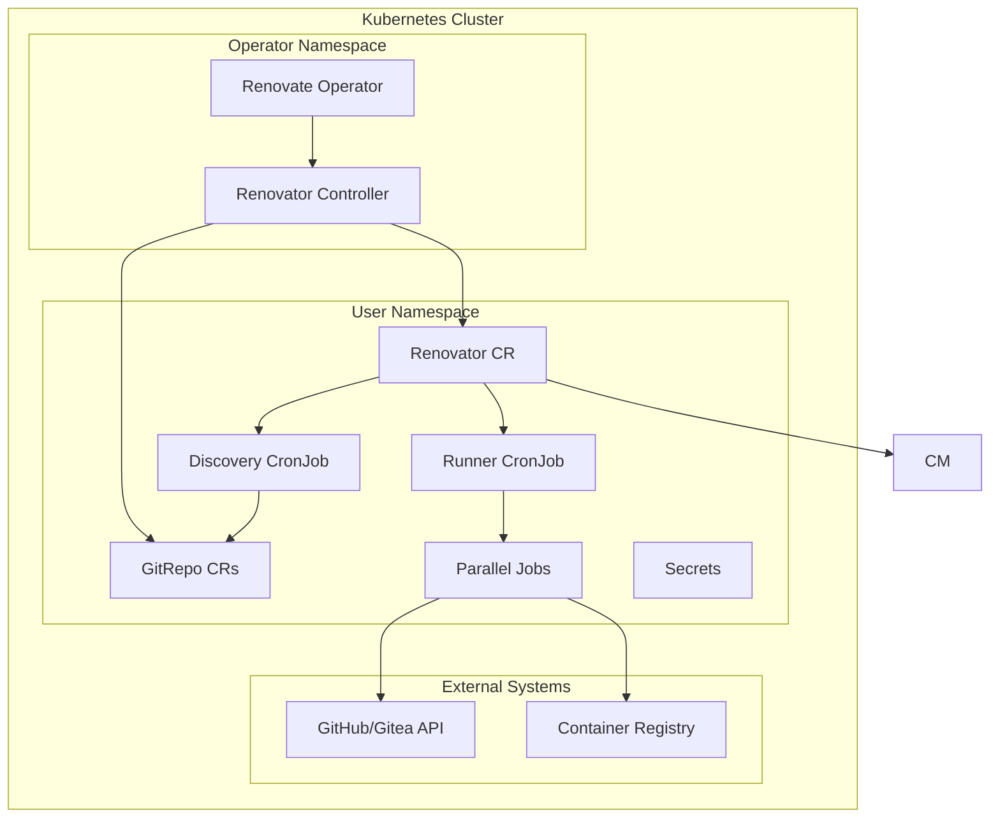

# Architecture Overview

The renovate-operator follows a modern Kubernetes operator pattern with intelligent parallel processing capabilities. This document provides a comprehensive overview of the system architecture and its components.

## System Architecture



## Core Components

### 1. Renovate Operator

The main operator binary that runs in the cluster and manages all Custom Resources.

**Key Responsibilities:**

- Watches Renovator Custom Resources
- Manages lifecycle of dependent resources
- Handles resource reconciliation
- Provides health checks and metrics

**Location:** `cmd/main.go`

### 2. Controllers

#### Renovator Controller

The primary controller responsible for managing the complete Renovator lifecycle.

**Location:** `internal/controller/renovator_controller.go`

**Functions:**

- Creates and manages CronJobs for scheduled execution
- Orchestrates discovery reconciler
- Orchestrates runner reconciler
- Updates status and conditions

#### Discovery Reconciler

Manages repository discovery from Git platforms.

**Location:** `pkg/reconciler/discovery/`

**Functions:**

- Creates CronJob that runs repository discovery using Renovate's autodiscover feature
- Runs Renovate init container with `RENOVATE_AUTODISCOVER=true` to discover repositories
- Executes discovery container that reads repository list file and creates GitRepo CRs
- Applies filtering rules and handles cleanup of removed repositories

#### Runner Reconciler

Manages the execution of Renovate jobs.

**Location:** `pkg/reconciler/runner/`

**Functions:**

- Creates Indexed Kubernetes Jobs for parallel repository processing
- Uses dispatcher container to prepare repository lists for each job index
- Manages job lifecycle and cleanup
- Controls parallel execution based on the `instances` configuration (sets job parallelism)
- Handles failure scenarios and resource management

### 3. Custom Resource Definitions (CRDs)

#### Renovator CRD

The main configuration resource that defines a Renovate instance.

**API Version:** `renovate.thegeeklab.de/v1beta1`

**Key Specs:**

- **Platform Configuration**: Git platform connection details
- **Discovery Settings**: Repository discovery and filtering
- **Runner Configuration**: Parallel processing configuration
- **Renovate Settings**: Renovate-specific configuration
- **Scheduling**: CronJob schedule configuration

#### GitRepo CRD

Represents a discovered repository that can be processed by Renovate.

**API Version:** `renovate.thegeeklab.de/v1beta1`

**Key Specs:**

- Repository name and URL
- Platform-specific metadata
- Processing status
- Last update timestamp

### 4. Supporting Components

#### Dispatcher

A utility component that prepares Renovate execution.

**Location:** `dispatcher/`

**Functions:**

- Prepares repository lists
- Prepares Renovate configuration
- Handles environment variable setup

#### Discovery Service

A standalone service for repository discovery that can run independently or as part of the operator.

**Location:** `discovery/`

**Functions:**

- Platform API integration
- Repository enumeration
- Metadata extraction
- Rate limiting and error handling

## Data Flow

### 1. Discovery Phase

1. **User creates Renovator CR** with platform and discovery configuration
2. **Discovery Controller** creates a CronJob for repository discovery
3. **Renovate init container** runs with `RENOVATE_AUTODISCOVER=true` and writes discovered repositories to a file
4. **Discovery container** reads the repository file and creates GitRepo CRs
5. **Repository list** is maintained and updated, with cleanup of removed repositories

### 2. Execution Phase

1. **CronJob triggers** based on schedule
2. **Runner Reconciler** reads GitRepo CRs
3. **Job Creation**: Creates one job per repository
4. **Parallel Kubernetes Jobs** are created
5. **Dispatcher init containers** prepare each job
6. **Renovate containers** process repositories
7. **Job cleanup** occurs after completion

### 3. Status Management

1. **Controllers update** CR status continuously
2. **Conditions reflect** current operational state
3. **Metrics are exposed** for monitoring
4. **Events are generated** for audit trail

## Parallel Processing Architecture

### Parallel Processing Modes

The operator supports two parallel processing modes:

#### 1. Indexed Mode (Primary)

```yaml
apiVersion: batch/v1
kind: Job
spec:
  completionMode: Indexed
  completions: 12 # Total number of repositories to process
  parallelism: 4 # Parallel workers (controlled by runner.instances)
  template:
    spec:
      initContainers:
        - name: renovate-dispatcher
          command: ["/dispatcher"]
      containers:
        - name: renovate
          env:
            - name: JOB_COMPLETION_INDEX
              value: "0" # Job index (0-11)
```

#### 2. Single Repository Mode (Immediate Execution)

```yaml
apiVersion: batch/v1
kind: Job
spec:
  completionMode: NonIndexed
  completions: 1
  parallelism: 1
  template:
    spec:
      containers:
        - name: renovate
          env:
            - name: RENOVATE_REPOSITORIES
              value: "owner/repo" # Specific repository to process
```

### Parallel Processing Approach

The operator uses **Indexed Jobs** as the primary approach for parallel processing. A single Indexed Job is created with:

- `completions`: Set to the total number of repositories to process
- `parallelism`: Set to the value of `runner.instances` (controls concurrent workers)
- `completionMode: Indexed`: Enables job indexing capabilities

The dispatcher container prepares repository lists for each job index (`JOB_COMPLETION_INDEX`), allowing efficient parallel processing of multiple repositories within a single Kubernetes Job resource.

## Parallel Processing Details

The operator uses **Indexed Jobs** as the primary parallel processing mechanism:

- **Indexed Mode**: Creates a single Indexed Job with `completions` set to the number of repositories and `parallelism` set to `runner.instances`
- **Dispatcher Container**: Uses an init container (`renovate-dispatcher`) to prepare repository lists for each job index
- **Parallel Execution**: Limits concurrent execution based on the `instances` value
- **Efficient Resource Usage**: Uses Kubernetes Indexed Job capabilities for better resource management

The **Single Repository Mode** is used for immediate execution triggered by annotations, where each repository gets its own individual NonIndexed Job.

## Monitoring and Observability

### Metrics

- **Controller Metrics**: Reconciliation rates, errors, duration
- **Job Metrics**: Job execution times, success rates
- **Discovery Metrics**: Repository counts, API rate limits
- **Resource Metrics**: CPU, memory, network usage

### Logging

- **Structured Logging**: JSON format with consistent fields
- **Log Levels**: Configurable verbosity (trace, debug, info, warn, error)
- **Context Correlation**: Request IDs and trace information

### Health Checks

- **Readiness Probes**: Controller readiness status
- **Liveness Probes**: Process health monitoring
- **Startup Probes**: Initialization phase monitoring
